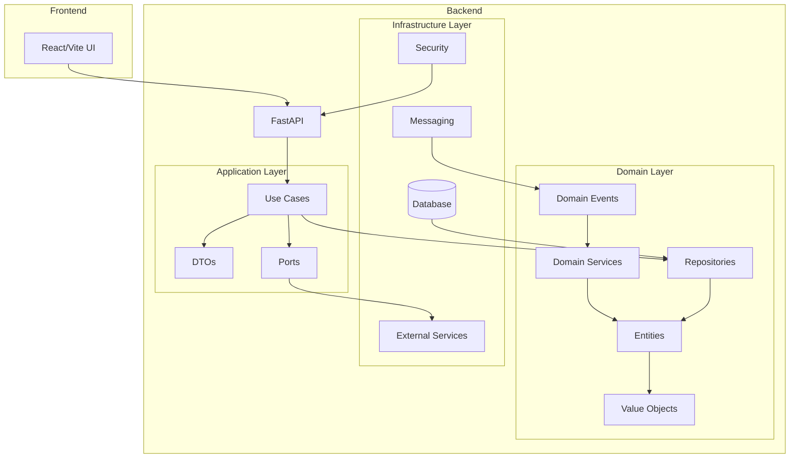

# Обзор архитектуры проекта MiniTMS

## Общая информация

MiniTMS - это система управления транспортной компанией, ориентированная на автоматизацию поиска грузов с портала trans.eu и оптимизацию логистических процессов. Проект разработан с использованием современных технологий и архитектурных подходов, включая Clean Architecture и Domain-Driven Design (DDD).

## Архитектурные принципы

Согласно документации (docs/ANALYSIS.md), проект следует следующим архитектурным принципам:

1. **Clean Architecture** - разделение на слои (Domain, Application, Infrastructure)
2. **Domain-Driven Design** - бизнес-логика в центре
3. **CQRS** (частично) - разделение команд и запросов
4. **Event-Driven** - доменные события для слабой связности
5. **API-First** - RESTful API как основа интеграции

## Структура проекта

Проект организован по принципам чистой архитектуры с тремя основными уровнями:

```
backend/
├── src/
│   ├── domain/           # Ядро бизнес-логики
│   ├── application/      # Логика прикладного уровня
│   └── infrastructure/   # Инфраструктурные компоненты
```

### 1. Слой домена (Domain Layer)

Содержит бизнес-сущности, сервисы, репозитории и события:

#### Сущности (Entities)
- **User** - пользователь системы с различными ролями (Administrator, Director, Dispatcher, Guest)
- **Cargo** - данные о грузе (пустой файл в текущей версии)
- **Order** - заказ (пустой файл в текущей версии)
- **Vehicle** - транспортное средство (пустой файл в текущей версии)
- **Plan** - финансовый план
- **GPSData** - данные GPS-навигации
- **EmailHistory** - история отправленных писем

#### Значимые объекты (Value Objects)
- **Coordinates** - координаты местоположения
- **Dimensions** - габариты груза или транспорта
- **Profitability** - показатели рентабельности
- **Route** - маршрут следования

#### Доменные сервисы (Domain Services)
- **ProfitabilityCalculator** - расчет прибыльности рейса
- **RouteOptimizer** - оптимизация маршрутов
- **PlanValidator** - валидация финансовых планов

#### Репозитории (Repositories)
- **CargoRepository** - репозиторий грузов
- **OrderRepository** - репозиторий заказов
- **PlanRepository** - репозиторий планов
- **UserRepository** - репозиторий пользователей
- **VehicleRepository** - репозиторий транспорта

#### Доменные события (Domain Events)
- **CargoFound** - найден новый груз
- **OrderCreated** - создан новый заказ
- **PlanExceeded** - превышен план

### 2. Слой приложения (Application Layer)

Содержит DTO, порты и варианты использования:

#### DTO (Data Transfer Objects)
- **AuthDTO** - данные аутентификации
- **CargoDTO** - данные о грузе
- **OrderDTO** - данные о заказе
- **VehicleDTO** - данные о транспорте

#### Порты (Ports)
- **EmailPort** - интерфейс для отправки email
- **GPSPort** - интерфейс для получения GPS-данных
- **MapsPort** - интерфейс для работы с картами
- **NotificationPort** - интерфейс для уведомлений
- **ScrapingPort** - интерфейс для скрапинга
- **SheetsPort** - интерфейс для работы с Google Sheets
- **UserRepositoryProtocol** - протокол репозитория пользователей

#### Варианты использования (Use Cases)
- **Auth** - аутентификация и регистрация
  - LoginUser
  - RegisterUser
  - RefreshToken
- **Cargo** - работа с грузами
  - SearchCargos
  - CalculateProfitability
  - FilterByVehicle
- **Fleet** - управление автопарком
  - AddVehicle
  - GetVehicleLocation
  - UpdateVehicleStatus
- **Orders** - работа с заказами
  - CreateOrder
  - SendCommercialOffer
  - SyncToGoogleSheets
- **Planning** - финансовое планирование
  - SetMonthlyPlan
  - TrackPlanExecution
  - CalculateAverageRate
- **Notifications** - уведомления
  - SendPushNotification
  - SendTelegramAlert

### 3. Инфраструктурный слой (Infrastructure Layer)

Содержит API, конфигурацию, внешние сервисы, сообщения и персистентность:

#### API
- **API v1** - REST API с эндпоинтами для различных модулей
  - Auth endpoints
  - Cargo endpoints
  - Fleet endpoints
  - Order endpoints
  - Planning endpoints
  - Reports endpoints
  - Settings endpoints
  - User endpoints

#### Внешние сервисы
- **Google Maps** - для расчета расстояний
- **Google Sheets** - для синхронизации данных
- **GPS системы** - Wialon, GPS-Trace, Navixy
- **SMTP** - для отправки email
- **Telegram** - для уведомлений
- **Trans.eu** - для получения грузов

#### Персистентность
- **SQLAlchemy** - ORM для работы с базой данных
- **Модели SQLAlchemy** - ORM модели для сущностей
- **Репозитории SQLAlchemy** - реализации репозиториев
- **Миграции Alembic** - управление изменениями схемы БД

#### Безопасность
- **JWT Handler** - обработка JWT токенов
- **Password Hasher** - хеширование паролей
- **RBAC** - роль-ориентированный контроль доступа

#### Сообщения
- **Event Bus** - шина событий
- **Task Queue** - очередь задач

## Паттерны проектирования

### Domain-Driven Design (DDD)

Проект реализует несколько ключевых элементов DDD:

1. **Сущности (Entities)** - объекты с уникальным идентификатором и жизненным циклом (User, Vehicle, Cargo, Order)
2. **Значимые объекты (Value Objects)** - объекты без уникального идентификатора, определяемые своими значениями (Coordinates, Dimensions, Profitability)
3. **Сервисы домена (Domain Services)** - бизнес-логика, которая не принадлежит конкретной сущности
4. **Репозитории (Repositories)** - абстракции для доступа к данным
5. **Фабрики (Factories)** - создание сложных объектов (не явно реализованы в текущей структуре)
6. **События домена (Domain Events)** - сигналы о произошедших бизнес-событиях

### Чистая архитектура (Clean Architecture)

1. **Зависимости направлены внутрь** - внешние слои зависят от внутренних
2. **Внутренние слои не зависят от внешних** - бизнес-логика изолирована
3. **Интерфейсы адаптеров** - внешние компоненты соответствуют внутренним контрактам

### Порты и адаптеры (Ports and Adapters)

- **Порты** - интерфейсы, определенные в прикладном слое
- **Адаптеры** - конкретные реализации, реализующие порты во внешнем слое

## Компоненты системы

### Модуль аутентификации (Authentication Module)
- Регистрация и вход пользователей
- JWT-аутентификация
- Ролевая модель (Administrator, Director, Dispatcher, Guest)
- Защита от брутфорса

### Модуль поиска грузов (Cargo Search Module)
- Интеграция с Trans.eu через скрапинг
- Playwright для эмуляции браузера
- Расчет рентабельности рейсов
- Фильтрация по параметрам транспорта

### Модуль управления флотом (Fleet Management Module)
- Учет транспортных средств
- Статусы транспорта (FREE, BUSY, MAINTENANCE, N/A)
- Интеграция с GPS-системами

### Модуль заказов (Orders Module)
- Создание и управление заказами
- Интеграция с Google Sheets
- Отправка коммерческих предложений

### Модуль планирования (Planning Module)
- Финансовое планирование
- План/факт анализ
- Контроль выполнения планов

### Модуль уведомлений (Notifications Module)
- Push-уведомления
- Telegram-бот
- Email-рассылки

## Интеграции

### Внешние API
- **Trans.eu** - получение данных о грузах
- **Google Maps/OSRM** - расчет маршрутов и расстояний
- **Google Sheets** - синхронизация заказов
- **GPS-платформы** - отслеживание местоположения транспорта

### База данных
- **PostgreSQL** - основная реляционная БД
- **SQLAlchemy** - ORM для работы с БД
- **Alembic** - миграции схемы

### Фоновые задачи
- **Celery** - обработка фоновых задач
- **Redis** - брокер сообщений и кэширование
- **Очереди задач** для скрапинга, уведомлений, синхронизации

## Диаграмма архитектуры



## Технологии

### Backend
- **FastAPI** - современный async веб-фреймворк
- **PostgreSQL** - надежная реляционная БД
- **SQLAlchemy** - ORM для работы с БД
- **Celery + Redis** - фоновые задачи и очереди
- **Playwright** - headless браузер для скрапинга SPA
- **Alembic** - миграции базы данных

### Интеграции
- **OpenStreetMap (OSRM)** - маршрутизация и расчет расстояний
- **Nominatim** - геокодирование
- **Google Sheets API** - синхронизация данных
- **GPS-платформы** - Wialon, GPS-Trace, Navixy

## Заключение

Проект MiniTMS демонстрирует хорошо спроектированную архитектуру, следующую принципам Domain-Driven Design и Clean Architecture. Структура проекта позволяет легко масштабировать и поддерживать код, а разделение на слои обеспечивает независимость бизнес-логики от инфраструктурных деталей. Архитектура поддерживает расширяемость и тестируемость приложения.