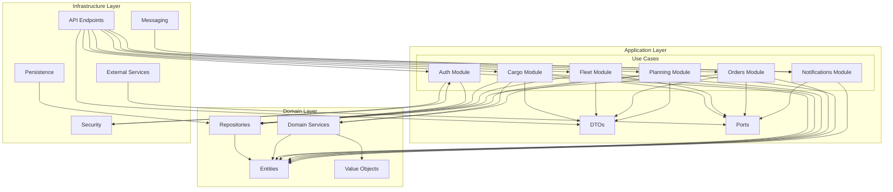

# Анализ зависимостей между модулями проекта MiniTMS

## Введение

В этом документе представлен анализ зависимостей между различными модулями проекта MiniTMS. Понимание этих зависимостей важно для правильного проектирования, тестирования и поддержки системы.

## Структура зависимостей

### 1. Зависимости по архитектурным слоям

#### Слой домена (Domain Layer)
- Не зависит от других слоев
- Является ядром системы
- Определяет бизнес-сущности и правила

#### Слой приложения (Application Layer)
- Зависит от слоя домена
- Не зависит от инфраструктурного слоя
- Содержит варианты использования и интерфейсы (порты)

#### Инфраструктурный слой (Infrastructure Layer)
- Зависит от слоев домена и приложения
- Реализует интерфейсы, определенные во внутренних слоях
- Содержит конкретные реализации

### 2. Зависимости между модулями приложения

#### Модуль аутентификации (Auth)
- Использует UserRepository для работы с пользователями
- Зависит от Security компонентов (JWT, PasswordHasher)
- Взаимодействует с User Entity

#### Модуль грузов (Cargo)
- Зависимости от:
  - CargoRepository для хранения/получения данных
  - VehicleRepository для фильтрации по транспорту
  - ProfitabilityCalculator для расчета рентабельности
  - External scraping services для получения данных
- Использует доменные сущности и DTO

#### Модуль флота (Fleet)
- Зависимости от:
  - VehicleRepository для управления транспортом
  - GPSPort для получения местоположения
  - Vehicle Entity для бизнес-логики

#### Модуль заказов (Orders)
- Зависимости от:
  - OrderRepository для хранения заказов
  - SheetsPort для синхронизации с Google Sheets
  - EmailPort для отправки коммерческих предложений
  - NotificationPort для уведомлений

#### Модуль планирования (Planning)
- Зависимости от:
  - PlanRepository для хранения планов
  - PlanValidator для проверки планов
  - OrderRepository для получения данных о выполнении

#### Модуль уведомлений (Notifications)
- Зависимости от:
  - NotificationPort для отправки уведомлений
  - Various event handlers для триггеров

### 3. Диаграмма зависимостей модулей

### 4. Зависимости от внешних сервисов

#### Внешние API
- **Trans.eu** - используется модулем грузов через ScrapingPort
- **Google Sheets API** - используется модулем заказов через SheetsPort
- **GPS платформы (Wialon, Navixy, GPS-Trace)** - используются модулем флота через GPSPort
- **Google Maps / OSRM** - используется для расчета маршрутов через MapsPort
- **SMTP сервер** - используется для email-уведомлений через EmailPort
- **Telegram Bot API** - используется для уведомлений через NotificationPort

#### База данных
- **PostgreSQL** - используется через Persistence слой
- **SQLAlchemy ORM** - абстрагирует работу с БД
- **Alembic** - управляет миграциями схемы

#### Фоновые задачи
- **Redis** - используется как брокер сообщений для Celery
- **Celery** - обрабатывает фоновые задачи (скрапинг, уведомления, синхронизация)

### 5. Зависимости через события домена

Система использует событийно-ориентированную архитектуру:

- **CargoFound** → обрабатывается ProfitabilityService, NotificationService
- **OrderCreated** → обрабатывается GoogleSheetsSync, EmailService
- **VehicleMoved** → обрабатывается ScrapingService (для пересчета)

### 6. Зависимости между DTO

#### Связи DTO
- CargoOfferDto использует LocationDto и ProfitabilityDto
- VehicleDto может использовать VehicleDimensionsDto
- PlanFactReportDto использует MetricComparisonDto
- OrderSheetRowDto объединяет данные из нескольких источников

### 7. Потенциальные проблемы зависимостей

#### Циклические зависимости
- На данный момент циклических зависимостей не обнаружено благодаря четкому разделению слоев
- Все зависимости направлены внутрь (от внешних слоев к внутренним)

#### Избыточные зависимости
- Важно следить за тем, чтобы Use Cases не зависели от других Use Cases напрямую
- Следует избегать зависимости Use Cases от конкретных инфраструктурных реализаций

#### Управление зависимостями
- Использование принципа инверсии зависимостей (Dependency Inversion Principle)
- Интерфейсы (порты) определяются на уровне приложения
- Конкретные реализации предоставляются инфраструктурным слоем

### 8. Управление зависимостями в проекте

#### Dependency Injection
- В проекте предполагается использование DI для внедрения зависимостей
- Это позволяет:
  - Легко заменять реализации
  - Упрощает тестирование
  - Поддерживает принципы SOLID

#### Configuration Management
- Используется Pydantic Settings для управления конфигурацией
- Настройки изолированы в инфраструктурном слое
- Позволяет легко менять конфигурацию для разных окружений

## Заключение

Проект MiniTMS демонстрирует хорошую практику управления зависимостями с использованием принципов чистой архитектуры. Зависимости направлены внутрь, внутренние слои не зависят от внешних, что обеспечивает гибкость, тестируемость и поддерживаемость системы. 

Архитектура позволяет легко интегрировать новые внешние сервисы через паттерн портов и адаптеров, а событийно-ориентированная архитектура обеспечивает слабую связанность между модулями. Такая структура зависимостей способствует долгосрочной устойчивости и расширяемости системы.